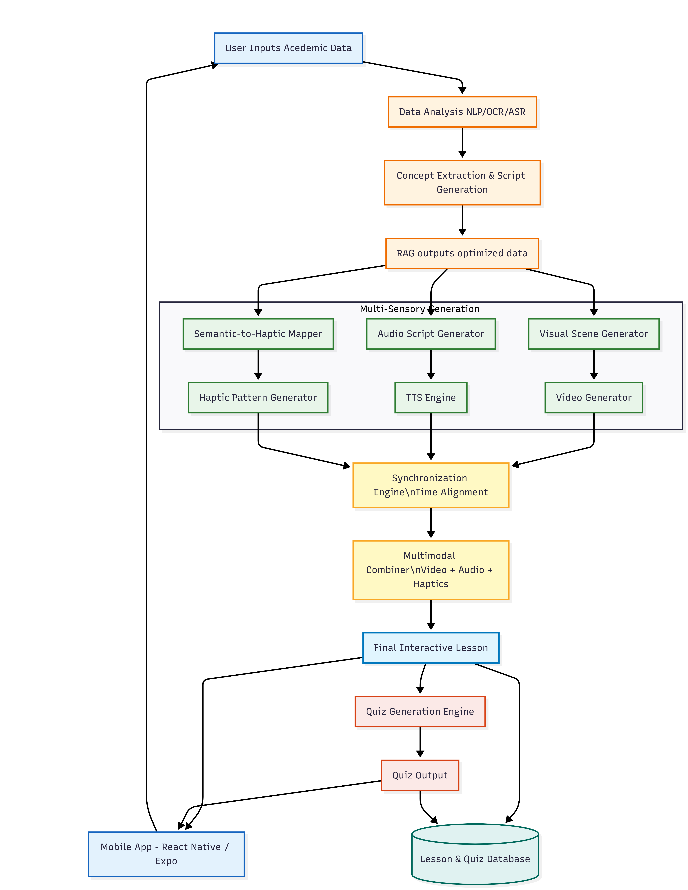

# 🎓 Sensory Learning Companion

### Multimodal Learning System for Accessible Education

> An inclusive learning platform designed to support diverse learners through multimodal interaction and adaptive educational tools.

---

## 📌 Project Information

* **Project Code:** 25-26J-217
* **Degree Program:** BSc (Hons) in Information Technology
* **Institution:** Sri Lanka Institute of Information Technology (SLIIT)

---

 # Project Repository Link
 
 
*[SENSORY-LEARNING-COMPANION WEB APPLICATION](https://github.com/thisaldil/SENSORY-LEARNING-COMPANION)</br>
*[SENSORY-LEARNING-COMPANION MOBILE APPLICATION](https://github.com/thisaldil/EduSense)


## 👥 Group Members

| Student ID | Name                 | Component                               | Branch                                                                                                                   |
| ---------- | -------------------- | --------------------------------------- | ------------------------------------------------------------------------------------------------------------------------ |
| IT22551252 | Gonsalkorala T. D.   |  Educational Script & Scene Generation  | [IT22551252-Gonsalkorala-T-D-](https://github.com/thisaldil/SENSORY-LEARNING-COMPANION/tree/IT22551252-Gonsalkorala-T-D-)|
|            |                      |                                         | [Educational-Scene-&-Script](https://github.com/thisaldil/SENSORY-LEARNING-COMPANION/tree/Educational-Scene-%26-Script)  |
| IT22186256 | Bhashitha W. K. V.   |  Visual Experience Development          | [IT22186256-W.K.V-Bhashitha](https://github.com/thisaldil/SENSORY-LEARNING-COMPANION/tree/IT22186256-W.K.V-Bhashitha)    |
| IT22213662 | Nanayakkara K. E. D. |  Cognitive Load Aware Adaption          | [Quiz_Generater](https://github.com/thisaldil/SENSORY-LEARNING-COMPANION/tree/quiz_generater)                            |
|            |                      |                                         | [IT22213662-Nanayakkara-K-E-D](https://github.com/thisaldil/SENSORY-LEARNING-COMPANION/tree/IT22213662-Nanayakkara-K-E-D)|
| IT22268594 | Madhuka H. W. E.     |  Audio-&-Haptic-Experience              | [Audio-&-Haptic-Experience](https://github.com/thisaldil/SENSORY-LEARNING-COMPANION/tree/Audio-%26-Haptic-Experience)    |


---
## System Architecture



## 🎓 Supervisors

* **Ms. Thamali Kelegama /Mr Nelum Chathuranga**
*  **Ms. Nimasha Chinthaka**

---

## 🧠 Project Overview

The Sensory Learning Companion is a multimodal learning system developed to improve educational accessibility for learners with diverse sensory needs. The platform integrates visual, auditory, and interactive components to enhance comprehension, engagement, and retention.

The system is designed with a strong focus on usability, inclusivity, and real world applicability in modern educational environments.

---

## 🏗️ System Architecture

The system follows a modular client server architecture.

* The **frontend** handles user interaction, learning interfaces, and accessibility features.
* The **backend** manages authentication, content processing, learning logic, and API services.
* The **database** stores user data, learning content, progress tracking, and analytics.

All components communicate through secure RESTful APIs to ensure scalability and maintainability.

---

## 🛠️ Technology Stack

### Frontend

* Framework: React Js / React Native
* Styling: Tailwind CSS
* State Management: Context API 

### Backend

* Runtime: Python
* Framework: FastAPI
* API Style: REST
* Authentication: JWT based authentication

### Database

* Database Type: MongoDB

### Other Tools

* Version Control: Git and GitHub
* Deployment: Vercel / Render
* Libraries and Services:

  
  

---

## 📂 Project Structure

```
sensory-learning-companion/
│
├── client/           # Frontend application
├── server/           # Backend services
      ├── models/           # Database schemas
      ├── routes/           # API routes
      ├── controllers/      # Business logic
      ├── public/           # Static assets
└── README.md
```

---

## ⚙️ Installation and Setup

1. Clone the repository

   ```
   git clone https://github.com/your-repo/sensory-learning-companion.git
   ```

2. Install dependencies

   ```
   npm install
   ```

3. Configure environment variables
   Create a `.env` file with required values.

4. Run the application

   ```
   npm run dev
   ```

---

## 🧪 Testing

* Manual testing was conducted for all user flows
* API endpoints were tested for correctness and error handling
* Accessibility checks were performed on key learning interfaces

---

## 🚧 Limitations

* Some accessibility features are limited by device capabilities
* Advanced personalization is constrained by available training data

---

## 🚀 Future Enhancements

* AI driven personalized learning paths
* Expanded support for assistive technologies
* Performance optimization for low end devices
* Multilingual learning support

---

## 📜 License

This project is developed for academic purposes under SLIIT and is not intended for commercial distribution.

---

## 🙏 Acknowledgements

* Project supervisors for guidance and feedback
* Sri Lanka Institute of Information Technology
* Open source libraries and tools used in development

---

